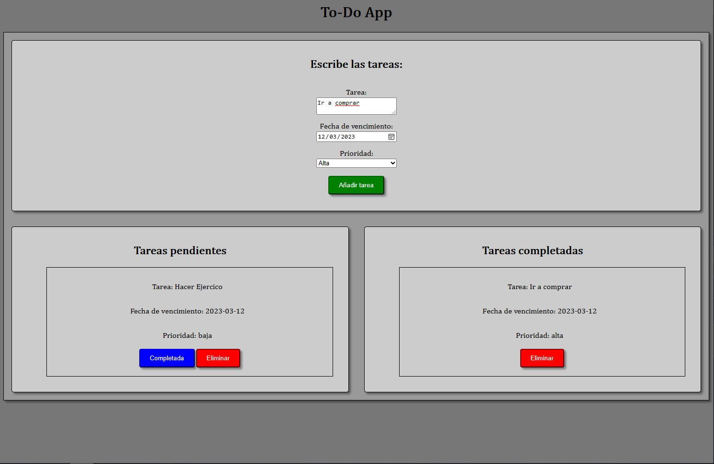

# To-Do App

A simple To-Do application built with HTML, CSS, and JavaScript.

## Description

The To-Do app allows users to create tasks and add them to a task list. Each task in the list has two buttons - one to mark it as completed and another to delete the task.

## Features

- Create tasks and add them to the task list.
- Mark tasks as completed.
- Delete tasks from the task list.

## Technologies Used

- HTML
- CSS
- JavaScript

## Installation

1. Clone the repository: `git clone https://github.com/davidordo85/to-do-app.git`
2. Open the index.html file in your web browser.

## Usage

1. Enter a task in the input field.
2. Click the "Add Task" button to add the task to the task list.
3. To mark a task as completed, click the corresponding "Completed" button.
4. To delete a task, click the corresponding "Delete" button.

## Screenshots

## Contributing

Contributions are welcome! If you have any ideas or suggestions to improve the app, please submit a pull request.

## License

This project is licensed under the [MIT License](LICENSE).
